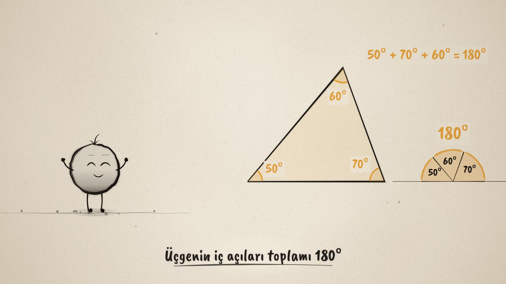
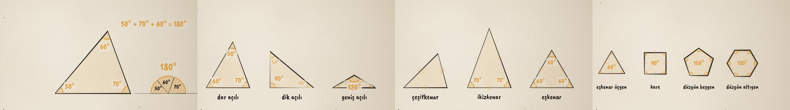

# Üçgenin Sırrı · The Triangle's Secret

**▶ Tarayıcıda izleyin / Watch in the browser:** https://hakanatas.github.io/ucgenin-sirri/ 
**⬇ MP4 + altyazılar / MP4 + subtitles:** [Releases](https://github.com/hakanatas/ucgenin-sirri/releases) 
**✎ Kullanılan istem / The prompt behind it:** [PROMPT.md](PROMPT.md)

> **TR —** 5. sınıf matematik "Geometrik Şekiller" temasındaki MAT.5.3.6 öğrenme çıktısı (çokgenlerin özellikleri) için hazırlanmış, tamamen JavaScript ile çizilen 92 saniyelik mürekkep animasyonu. Nokta bir üçgenin iç açılarını ölçüyor ve topluyor: 180°. Sonra köşeleri kesip bir doğrunun üzerine yan yana koyuyor ve bir doğru açı elde ediyor. Üçgenin şekli değişse de toplam hep 180° kalıyor. Film üçgenleri açılarına göre (dar, dik, geniş açılı) ve kenarlarına göre (çeşitkenar, ikizkenar, eşkenar) sınıflandırıyor, düzgün çokgenlerle bitiyor. Altyazılar Türkçe, İngilizce ya da ikisi birlikte seçilebilir.

A 92-second ink animation for **5th-grade maths**, drawn entirely with JavaScript on an HTML5 canvas. It is the fifth film in the geometry series, after [Noktadan Çembere](https://github.com/hakanatas/noktadan-cembere), [Kaç Derece?](https://github.com/hakanatas/kac-derece), [Doğrular Kesişince](https://github.com/hakanatas/dogrular-kesisince) and [Doğrulardan Çokgene](https://github.com/hakanatas/dogrulardan-cokgene). Nokta, the ink character from [The Learning Ink](https://github.com/hakanatas/the-learning-ink), is the guide again.

## Learning outcome

MEB, Türkiye Yüzyılı Maarif Modeli, Ortaokul Matematik, 5th grade, "Geometrik Şekiller" theme:

**MAT.5.3.6. Çokgenlerin özellikleri ile ilgili edindiği deneyimleri yansıtabilme**
- a) Çokgenlerin özellikleri ile ilgili edindiği deneyimleri gözden geçirir.
- b) Çokgenlerin kenar ve açı özelliklerine dair çıkarım yapar.
- c) Çıkarımını farklı örnekler üzerinden değerlendirir.

The program's notes for this outcome mention:

- inside and outside angles, and regular polygons (equal sides and equal inside angles);
- examining the angles of triangles: acute, right and obtuse;
- the inside angles of a triangle add up to 180°;
- scalene, isosceles and equilateral triangles;
- in an isosceles triangle the angles facing the equal sides are equal;
- in an equilateral triangle every inside angle is 60°.

## Designed to be easy to follow

- One idea per scene, with a single short caption on screen at a time.
- The same colour rule as the earlier films: **black ink = shapes**, **amber = measuring** (angles, degrees, equal-length marks).
- 180° is shown twice: first by adding the measured angles, then by tearing off the three corners and laying them side by side on a straight line. This is the classroom paper-tearing activity, animated.
- Outcome (c), "evaluate the conclusion with different examples", is shown literally. The triangle changes shape live, the three angles change, and the sum stays 180°. The shown angles are whole degrees that always add up to exactly 180.
- Equal sides are marked the way textbooks do it, with small tick marks.

## Scenes

| # | Time | Scene | What happens | Outcome |
|---|---|---|---|---|
| 1 | 0–8 s | Bir üçgen | Nokta is born and draws a triangle. | Intro |
| 2 | 8–30 s | Toplam 180° | The angles are measured (50°, 70°, 60°) and added up: 180°. The corners are torn off and laid on a straight line, making a straight angle. | 5.3.6 a, b |
| 3 | 30–44 s | Hep 180° | The triangle changes shape; the numbers change, but the sum stays 180°. | 5.3.6 c |
| 4 | 44–58 s | Açılarına göre | Dar açılı, dik açılı, geniş açılı. | 5.3.6 b |
| 5 | 58–76 s | Kenarlarına göre | Çeşitkenar, ikizkenar, eşkenar (tick marks). Equal sides face equal angles (70°–70°); an equilateral triangle has 60°–60°–60°. | 5.3.6 b |
| 6 | 76–84 s | Düzgün çokgenler | Equilateral triangle 60°, square 90°, regular pentagon 108°, regular hexagon 120°: every side equal, every angle equal. | 5.3.6 b |
| 7 | 84–92 s | Aklında kalsın | "Üçgenin iç açıları toplamı 180°." Nokta celebrates. | Wrap-up |

Not covered here: outside angles (dış açı). They would crowd a 90-second film for 5th graders and suit a short follow-up.

## Running it

- **Preview:** double-click `index.html` (it works offline). Controls: play/pause, timeline, scene jump, speed, 16:9 or 9:16, and captions Off / TR / EN / TR+EN.
- **MP4:** run `npm install` once, then `npm run export -- --format=horizontal --captions=tr`.
- **Subtitles and narration:** `npm run srt` writes `out/captions_*.srt` and `narration_notes.txt`.
- **Editing:**
  - Caption text, timings and narration notes: `captions.js`
  - Scenes: `scenes/scene1.js` … `scene7.js`
  - The triangle built from two base angles (`tri`, `angles`), angle arcs, tick marks, the torn corners (`tiles`) and Nokta's poses: `src/draw/film.js`
  - Layout for 16:9 and 9:16: `src/draw/kd.js`

It uses the same engine as The Learning Ink: `renderFrame(t)` as a pure function of time, seeded randomness, and frame-by-frame export.
